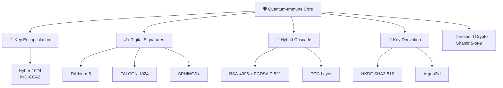
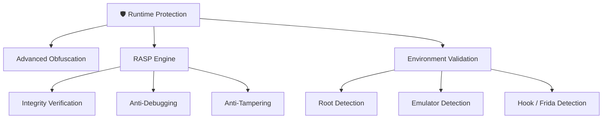
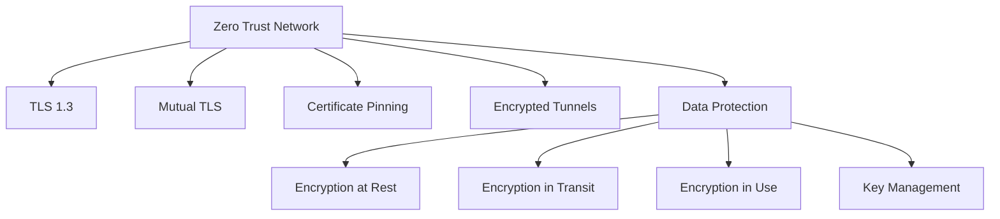
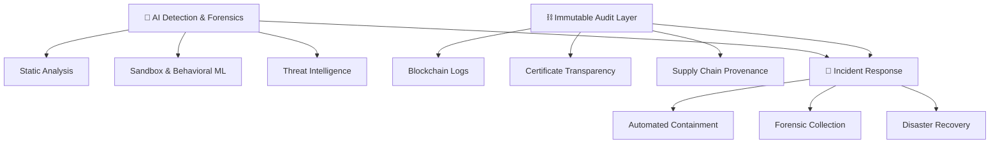

MPCtum-Safe Fortress

[](LICENSE)
[](https://github.com/5P4RUX/Quantum-Safe-Fortress/stargazers)
[](https://github.com/5P4RUX/Quantum-Safe-Fortress)

> **Enterprise-grade, bank-level post-quantum security reference architecture**  
> Designed for **high-assurance, regulated, and future-adversarial environments**.

---

## 📘 Overview

**Quantum-Safe Fortress** is a comprehensive **defense-in-depth security reference architecture**
engineered to remain resilient against:

- Classical adversaries  
- Quantum-capable attackers  
- Insider threats  
- Supply-chain compromises  
- Advanced Persistent Threats (APT)

This repository is **not an implementation**.  
It is a **conceptual blueprint / reference design** intended for:

- Financial institutions  
- Critical infrastructure  
- Government & defense systems  
- High-assurance enterprise environments  

The architecture emphasizes:

- **Algorithm agility**
- **Cryptographic redundancy**
- **Zero-trust principles**
- **Hardware-enforced trust**
- **Formal security assumptions**

---

## 🧠 Core Capabilities

- NIST-aligned **Post-Quantum Cryptography**
- Hybrid **Classical + PQC** cryptographic cascades
- **Zero-Trust Architecture**
- Secure **Multi-Party Computation (MPC)**
- **Zero-Knowledge Proofs**
- Hardware-backed **Root of Trust**
- AI-powered **forensics & threat detection**
- Immutable **audit & compliance layer**
- Confidential computing & encrypted execution

---

## 🧩 Architecture — Modular Overview

The system is designed as **independent but composable security modules**.  
Each module can be adopted individually or as part of the full fortress.

---

## 🧩 Module 1 — Quantum Cryptography Core



## 🎭 Module 2 — Trust & Privacy Layer (MPC + ZK)

```mermaid
graph TB
    TRUST[Distributed Trust Layer]

    TRUST --> MPC[Secure MPC]
    MPC --> FROST[FROST Signatures]
    MPC --> GG20[GG20 ECDSA]

    TRUST --> ZK[Zero Knowledge Proofs]
    ZK --> SNARK[ZK SNARK]
    ZK --> STARK[ZK STARK]
    ZK --> BP[Bulletproofs]

    ZK --> REC[Recursive Proofs]

    TRUST --> PRIV[Differential Privacy]ivacy
## ⚙️ Module 3 — Hardware Root of Trust

```mermaid
graph TB
    HW[🏰 Hardware Root of Trust]

    HW --> HSM[HSM Cluster<br/>FIPS 140-3 Level 4]
    HW --> SE[Secure Element]
    HW --> PUF[PUF-Based Identity]

    HW --> TEE[Trusted Execution Environment]
    TEE --> TRUSTZONE[ARM TrustZone]
    TEE --> SGX[Intel SGX]
    TEE --> SEV[AMD SEV-SNP]

    HW --> BOOT[Secure Boot Chain]
```

##🔬 Module 4 — Runtime & Binary Protection



## 🌐 Module 5 — Network & Data Security



##🔬 Module 6 — Detection, Audit & Incident Response



##🧭 Design Principles

• Defense-in-depth by default
• Zero-trust, identity-first access
• Cryptographic agility & redundancy
• Hardware-backed trust anchors
• Privacy-preserving verification
• Continuous monitoring & response

## ⚠️ Disclaimer

This project is provided for research and educational purposes only.
It is not a drop-in production solution and must be independently reviewed, audited, and adapted before real-world deployment.

## 📜 License

Licensed under the Apache License 2.0.
See LICENSE for details.

## 🏷️ Repository Topics

Post-Quantum Cryptography
Zero-Trust Architecture
Secure Multi-Party Computation
Zero-Knowledge Proofs
Hardware Root of Trust
AI Security & Forensics
Blockchain Audit
